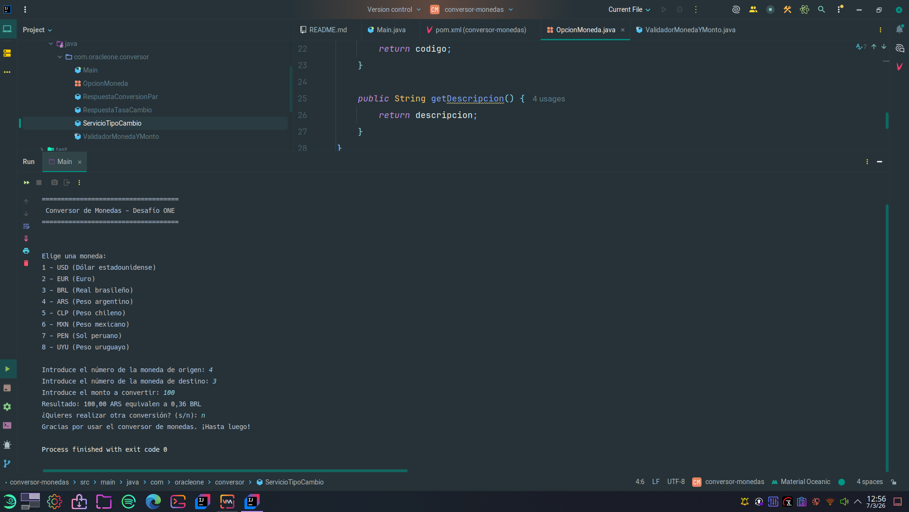

# Conversor de Monedas - Challenge ONE (Java Back End)

Proyecto del **Desafío Conversor de Monedas** del programa Oracle ONE. Aplicación de consola en Java que consume la API [ExchangeRate-API](https://www.exchangerate-api.com/) para realizar conversiones entre múltiples monedas.

## Funcionalidades

- **Menú por consola**: interfaz textual con opciones numéricas en un bucle, usando `Scanner` para la entrada del usuario.
- **Conversión entre 8 monedas**: USD, EUR, BRL, ARS, CLP, MXN, PEN y UYU.
- **Consulta por pares a la API**: para cada conversión se utiliza el endpoint `/pair/{FROM}/{TO}/{AMOUNT}` de ExchangeRate-API, empleando `HttpClient`, `HttpRequest` y `HttpResponse`.
- **Análisis de respuesta JSON**: uso de la biblioteca **Gson** para parsear la respuesta de la API y extraer el resultado de la conversión.
- **Cálculo de conversión**: el programa muestra el valor convertido devuelto por la API para el par de monedas elegido y el monto informado.
- **Validación básica**: comprobación de montos válidos y opciones correctas; mensajes claros en caso de error de red o API.

## Requisitos técnicos

- **Java**: JDK 17 o superior.
- **Maven**: para compilar y gestionar dependencias.
- **Gson**: 2.10.1 en adelante (en el proyecto se usa 2.11.0).
- **API**: clave de API de [ExchangeRate-API](https://www.exchangerate-api.com/) (cuenta gratuita).

## Cómo ejecutar

1. Clona o descarga el proyecto y entra en la carpeta:
   ```bash
   cd conversor-monedas
   ```

### Linux/macOS

2. Configura la variable de entorno `EXCHANGE_RATE_API_KEY` con tu clave de ExchangeRate-API (por ejemplo, en tu `.profile` o `.bashrc`):
   ```bash
   export EXCHANGE_RATE_API_KEY=TU_CLAVE_AQUI
   ```
3. Compila y empaqueta:
   ```bash
   mvn clean package
   ```
4. Ejecuta el JAR con dependencias:
   ```bash
   java -jar target/conversor-monedas-1.0-SNAPSHOT-jar-with-dependencies.jar
   ```

### Windows

2. Configura la variable de entorno `EXCHANGE_RATE_API_KEY`. En PowerShell (sesión actual):
   ```powershell
   $env:EXCHANGE_RATE_API_KEY = "TU_CLAVE_AQUI"
   ```
   O en CMD:
   ```cmd
   set EXCHANGE_RATE_API_KEY=TU_CLAVE_AQUI
   ```
   Para dejarla permanente: Panel de control → Sistema → Configuración avanzada del sistema → Variables de entorno → Nueva (variable de usuario o del sistema).
3. Compila y empaqueta:
   ```cmd
   mvn clean package
   ```
4. Ejecuta el JAR con dependencias:
   ```cmd
   java -jar target\conversor-monedas-1.0-SNAPSHOT-jar-with-dependencies.jar
   ```

## Tests automatizados

El proyecto incluye tests unitarios con JUnit 5 y Mockito. Para ejecutarlos:

```bash
mvn test
```

Cobertura por clase:

- **OpcionMonedaTest**: enum de monedas (cantidad, códigos, descripciones).
- **ValidadorMonedaYMontoTest**: parseo seguro de entrada (opción 1-8, monto con punto/coma, s/n); rechaza formatos incorrectos, vacíos, negativos y no numéricos.
- **RespuestaConversionParTest** y **RespuestaTasaCambioTest**: deserialización JSON de las respuestas de la API.
- **ServicioTipoCambioTest**: validación de parámetros (códigos no nulos/vacíos, monto positivo y finito); respuestas API exitosas y de error (con HttpClient mockeado).

## Estructura del proyecto (resumen)

- **Configuración del entorno**: proyecto Maven con Java 17.
- **Consumo de la API**: `ServicioTipoCambio` realiza la solicitud HTTP para el endpoint `/pair/{FROM}/{TO}/{AMOUNT}` y obtiene la respuesta de la conversión.
- **Análisis JSON**: `RespuestaConversionPar` (y `RespuestaTasaCambio` para otros posibles usos) y Gson para mapear la respuesta.
- **Filtro de monedas**: enum `OpcionMoneda` con las 8 monedas soportadas; el usuario puede combinar cualquier par entre ellas desde el menú.
- **Parseo de entrada**: `ValidadorMonedaYMonto` centraliza el parseo de opción de moneda (`parsearOpcionMoneda`), monto (`parsearMonto`) y s/n (`parsearSiNo`), rechazando formatos incorrectos.
- **Conversión e interacción**: `Main` muestra el menú, lee con `Scanner` (constante `LECTOR`), usa el validador y el servicio, y muestra el resultado.

## Captura



---

*Desafío completado en el marco del programa Oracle ONE - Java Back End.*
